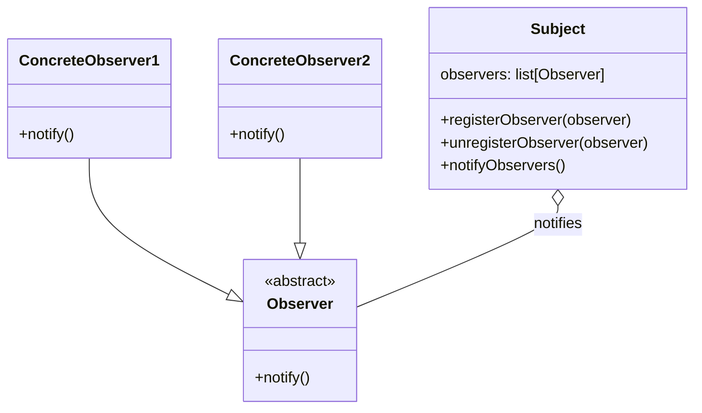

- Observer pattern
  - Mediator pattern (this is closer to event bus)
    - https://lostechies.com/derickbailey/2013/03/18/event-aggregator-andorvs-mediator-a-tale-of-two-patterns/
  - with event handler functions
  - when to use it: your functions do a lot of extra stuff that's not the responsibility of the function and don't affect the outcome that much

## Observer pattern diagram

## Mediator

TODO: add Mediator diagram and example
