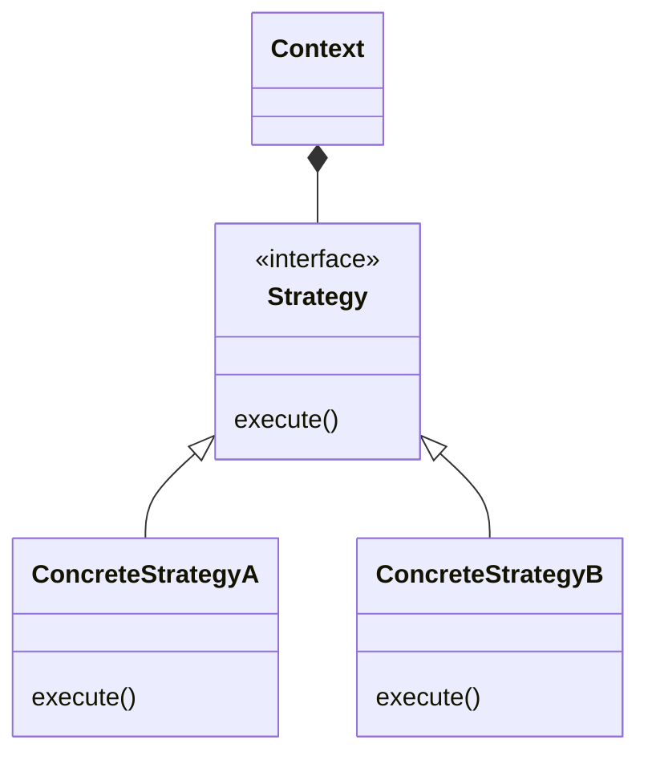
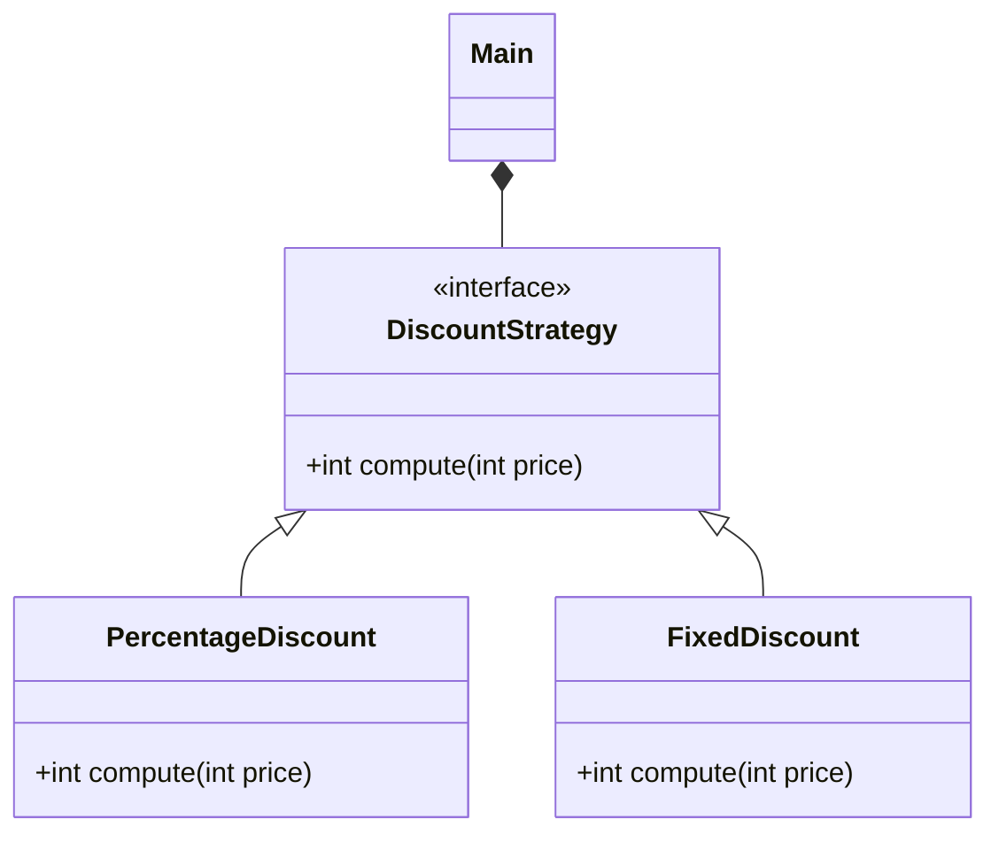

# Strategy pattern diagrams

- Explain the before version:
  - If-else statement that might become complex if more discount types are added
  - Magic numbers
- Classic strategy pattern:
  - We use ABC and inheritance
  - Still magic numbers in the strategy
- Now show functional version
- Another variant: callable (basically means removing the naming)
  - And move the magic numbers to instance variables
- How to do that in the functional scenario? Possibility: closures
- Another option: partial function application
