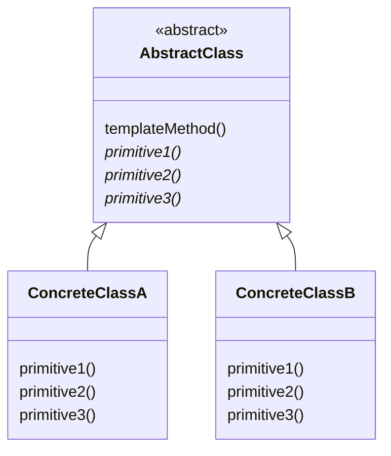
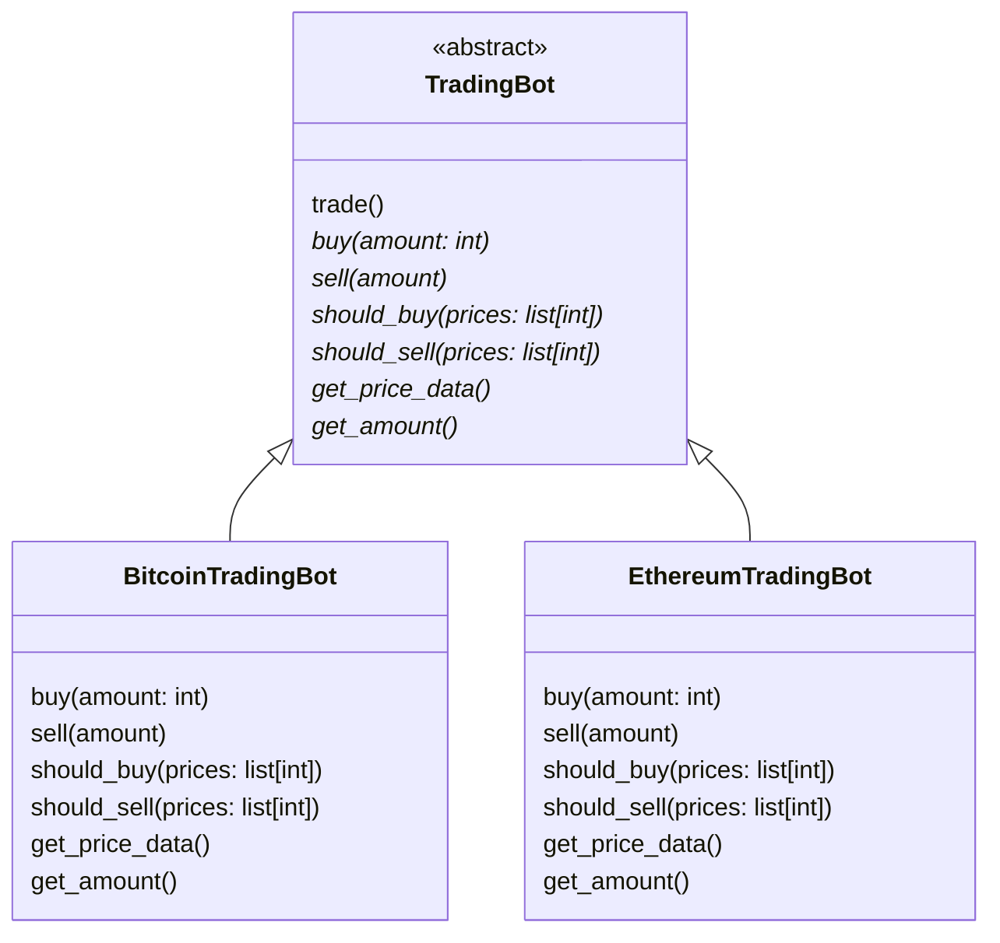

# Template method class diagram

- First version: create tradingbot and subclasses from scratch
- Turn the trade method into a function that gets an object
- Split the object into the exchange part and the trading strategy part
- Now split up the trading strategy into two separate functions
